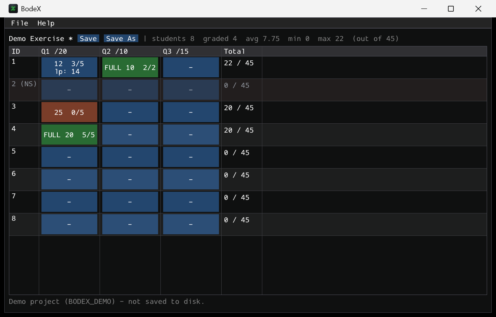

# BodeX

A private, single-user Windows desktop app for tracking exercise/exam grading — a
students × questions grid modeled on the paper notebook a grader fills in by
hand. Written in C++ with [Dear ImGui](https://github.com/ocornut/imgui)
(Win32 + Direct3D 11), it builds to one self-contained `.exe` with the MinGW
toolchain and needs no external libraries installed.



## What it does

- **Launch screen** — start a new project or resume a recent one.
- **New project setup** — choose the table size (N students × M questions).
  Students are just IDs `1..N`. Each question gets:
  - a point value,
  - a number of sub-questions,
  - an **Equal** split (each sub-question worth `points / count`) or a **Custom**
    split (type each sub-question's value, with a live sum-vs-total check).
- **Grading grid** — one cell per student × question. Per cell you record:
  - **awarded points** (typed directly),
  - **sub-questions answered** as `X / Y` (kept for reference; does not change the
    score),
  - a **green full-marks tick** — all sub-questions correct ⇒ the cell
    automatically scores the question's full points,
  - a **last page** note (e.g. `p.14`) so you can resume a question-by-question
    pass where you left off.
- **No submission** — click a student's ID cell and toggle *No submission*; the
  whole row automatically scores 0 and is greyed out.
- **Live totals** — each student's `score / max` updates as you grade, plus a
  class summary (graded count, average, min, max) in the toolbar.
- **Question images** — click a question's column header to attach screenshots:
  the **question sheet** and **solution references** used to verify checks. Tag
  each image with the sub-question(s) it covers, and preview it in a window you
  can keep open beside the grid. Images are copied into an assets folder beside
  the project so they travel with it.
- **Saved as JSON** — one `.json` file per project; reopen it any time. Recent
  projects are remembered.

Scoring precedence per cell: *no-submission* (row → 0) → *green tick* (→ full
points) → *awarded* (clamped to `[0, max]`; values over the max are flagged in
orange but never silently capped in storage).

## Requirements

- Windows 10/11.
- **MSYS2 / MinGW-w64** with `g++`, `mingw32-make`, and `windres` on `PATH`
  (this project was built with g++ 15.2). No CMake, Qt or vcpkg required.

The Direct3D 11 / DXGI / d3dcompiler libraries it links against ship with
Windows, and the binary is statically linked, so the resulting `.exe` runs
standalone.

## Build & run

```sh
mingw32-make          # build build/BodeX.exe (icon embedded)
mingw32-make run      # build and launch
mingw32-make test     # build & run the non-GUI core tests
mingw32-make clean    # remove build/
```

Then double-click `build/BodeX.exe` (or `mingw32-make run`). A **BodeX desktop
shortcut** (with the app icon) is also created for one-click access; recreate it
any time with:

```powershell
powershell -File tools/create_shortcut.ps1
```

### Quick look without setting up a project

Set `BODEX_DEMO=1` to launch straight into a populated sample grid (`=2` also
opens the cell editor). The demo project is in-memory only and is never written
to disk.

```sh
BODEX_DEMO=1 ./build/BodeX.exe
```

## Using it

1. **New Project** → set students, questions, and each question's points /
   sub-questions / split. A live **Total exam points** counter updates as you
   type. → **Create Project**.
2. **Right-click a cell** to toggle **full marks** (turns green); **hold and
   right-drag** to paint full marks across a whole **row or column** (direction
   picked from your drag). **Left-click a cell** to open its editor: awarded
   points, sub-questions answered (X/Y), last page (a page number with `-`/`+`
   steppers), and a note. The last page shows as `lp: N` on the cell's second line.
3. Click a **student ID** to mark *No submission* (row scores 0).
4. **Ctrl+S** (or the Save button) writes the project to a `.json` file. Closing
   with unsaved changes prompts to Save / Discard / Cancel.

Click a **question's column header** to open its image menu — add / preview /
remove the question sheet and solution-reference screenshots, each tagged to the
sub-questions it covers. Previews open in a separate, resizable window.

Projects and the recent-projects list live under
`%APPDATA%\BodeX\` by default (you can Save As / Open anywhere). A question's
images are copied next to its `.json` in a `<project>.assets/` folder.

## Project file format

A project is a single JSON document — `schemaVersion`, `name`, `createdIso`, the
`questions` array (title, `maxPoints`, `subCount`, `split`, `subPoints`), and the
`students` array (`id`, `noSubmission`, and a `cells` array with `fullTick`,
`awarded`, `subAnswered`, `lastPage`, `note`). It is plain text and easy to
inspect or diff.

## Layout

```
src/
  main.cpp                 Win32 + DX11 host and frame loop
  app/App.*                screen state machine, menu, save/exit guard
  ui/                      HomeScreen, NewProjectScreen, GradingTable,
                           CellEditor, widgets, native file dialogs
  model/                   Project (data), Scoring, Serialization (JSON), AppConfig
  util/utf.h               UTF-8 <-> UTF-16 helpers
tests/test_core.cpp        scoring rules + JSON/file round-trip (make test)
third_party/               Dear ImGui + backends, nlohmann/json (vendored)
resources/                 app manifest (DPI awareness)
```

The build emits clang flags via `compile_flags.txt` so the clangd language
server resolves includes without extra configuration.

## License & credits

BodeX is released under the [MIT License](LICENSE).

It vendors two excellent MIT-licensed libraries (their license notices travel
with their source under `third_party/`):

- [Dear ImGui](https://github.com/ocornut/imgui) © Omar Cornut — immediate-mode GUI
- [nlohmann/json](https://github.com/nlohmann/json) © Niels Lohmann — JSON for Modern C++
- [stb_image](https://github.com/nothings/stb) by Sean Barrett — public-domain image loader (`third_party/stb/`)
